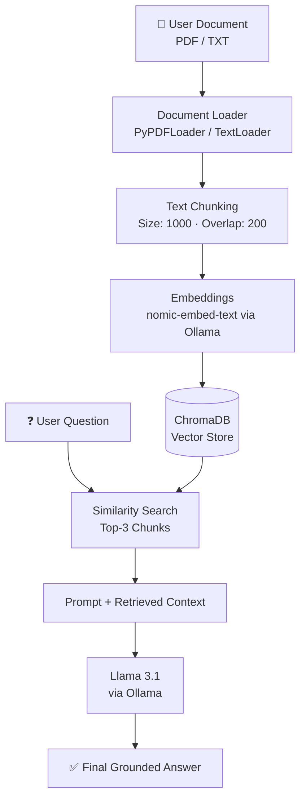

<div align="center">

# 📚 Local RAG — Document Question Answering System

**Ask questions about your own PDFs and text files, answered entirely offline.**

[](https://www.python.org/)
[](https://www.langchain.com/)
[](https://ollama.com/)
[](https://www.trychroma.com/)
[](LICENSE)

</div>

---

A local **Retrieval-Augmented Generation (RAG)** pipeline that lets you point a document at an LLM and get grounded, source-backed answers — with no cloud API calls and no data ever leaving your machine.

Feed it a PDF or text file, and it will chunk the document, embed it, store it in a vector database, and answer your questions using only what's actually in the file — powered end-to-end by **Ollama** and **Llama 3.1**.

## 📖 Table of Contents

- [Why This Project](#-why-this-project)
- [Features](#-features)
- [Architecture](#️-architecture)
- [Tech Stack](#️-tech-stack)
- [Getting Started](#-getting-started)
- [Usage](#-usage)
- [Project Structure](#-project-structure)
- [Core Components](#-core-components)
- [Use Cases](#-use-cases)
- [Roadmap](#️-roadmap)
- [Contributing](#-contributing)
- [License](#-license)
- [Author](#-author)

## 🧠 Why This Project

Standard LLM chat is limited to what the model memorized during training — it can't answer questions about *your* lecture notes, *your* contracts, or *your* internal docs, and it will happily hallucinate when it doesn't know.

RAG fixes this by inserting a retrieval step before generation:

```
User Question → Retrieve Relevant Chunks → Feed as Context → LLM Generates Grounded Answer
```

This project is a from-scratch, fully local implementation of that pattern — useful both as a working tool and as a reference for understanding how production RAG systems are built.

## ✨ Features

| | |
|---|---|
| 📄 | Supports both **PDF** and plain **text** documents |
| ✂️ | Automatic recursive chunking with configurable overlap |
| 🧠 | Semantic embeddings via `nomic-embed-text` |
| 🗄️ | Persistent vector storage with **ChromaDB** |
| 🔎 | Top-k similarity search with visible distance scores |
| 🤖 | Answer generation via **Llama 3.1** through Ollama |
| 🛡️ | Grounded prompting — the model states when an answer isn't in the document, instead of guessing |
| 💻 | 100% local — no API keys, no cloud calls, no data leaves your machine |
| 📊 | Transparent retrieval — see exactly which chunks and pages informed each answer |

## 🏗️ Architecture



**Ingestion (once per document):** load → chunk → embed → store.
**Query (every question):** embed question → retrieve top-3 chunks → build prompt → generate answer.

## 🛠️ Tech Stack

| Technology | Role |
|---|---|
| **Python** | Core application language |
| **LangChain** (LCEL) | RAG pipeline orchestration |
| **PyPDFLoader / TextLoader** | Document ingestion |
| **RecursiveCharacterTextSplitter** | Chunking with overlap |
| **Ollama** | Local model runtime |
| **nomic-embed-text** | Embedding model |
| **Llama 3.1** | Answer generation |
| **ChromaDB** | Vector database |

## 🚀 Getting Started

### Prerequisites

- Python 3.9+
- [Ollama](https://ollama.com/) installed and running
- `llama3.1` and `nomic-embed-text` pulled in Ollama

### 1. Clone the repository

```bash
git clone https://github.com/hassan-ansari/local-rag-qa.git
cd local-rag-qa
```

### 2. Create a virtual environment

```bash
# Windows
python -m venv venv
venv\Scripts\activate

# macOS / Linux
python3 -m venv venv
source venv/bin/activate
```

### 3. Install dependencies

```bash
pip install -r requirements.txt
```

<details>
<summary>Or install packages individually</summary>

```bash
pip install langchain-community langchain-text-splitters langchain-ollama langchain-chroma langchain-core
```
</details>

### 4. Pull the required Ollama models

```bash
ollama pull nomic-embed-text
ollama pull llama3.1
```

Make sure the Ollama service is running before you start the app.

## ▶️ Usage

Run the application:

```bash
python "RAG application.py"
```

You'll be prompted for a document path:

```
Enter path to your document (e.g., sample.pdf): documents/my_notes.pdf
```

The app will load, chunk, embed, and index the document, then drop you into an interactive Q&A loop:

```
==================================================
 RAG SYSTEM READY: Type your question or 'exit' to quit.
==================================================

Ask a question: What is the main objective of the project?

--- Performing Similarity Search ---
[Chunk 1] (Distance Score: 0.2145 | Page: 2)
...

--- Generating Grounded Response ---
Final Answer:
...
```

Exit anytime with `exit`, `quit`, or `q`.

## 📁 Project Structure

```
local-rag-qa/
├── RAG application.py      # Main application entry point
├── requirements.txt
├── README.md
├── documents/               # Place source PDFs/text files here
│   └── sample.pdf
└── chroma_db/                # Persistent vector store (auto-generated)
```

## 🧩 Core Components

| Function | Responsibility |
|---|---|
| `ingest_and_index()` | Loads the document, splits it into chunks, generates embeddings, and persists them to ChromaDB |
| `format_docs()` | Merges retrieved chunks into a single context string for the prompt |
| `run_qa_loop()` | Initializes the LLM, builds the retriever and LCEL chain, and drives the interactive Q&A session |

**Prompting philosophy:** the system prompt explicitly instructs the model to answer *only* from retrieved context, never extrapolate, and clearly say when the document doesn't contain the answer — minimizing hallucination.

## 🎯 Use Cases

- 📚 Study material and lecture-note Q&A
- 📄 Research paper analysis
- 🏫 Textbook and coursework reference
- 📑 Company / internal documentation search
- 🧾 Technical manual lookup
- 🗂️ Personal knowledge-base querying

## 🗺️ Roadmap

- [ ] Web UI (Streamlit / Gradio) instead of CLI
- [ ] Multi-document ingestion and cross-document retrieval
- [ ] Inline source citations in the final answer
- [ ] Conversational memory across questions
- [ ] Support for `.docx` and `.md` sources
- [ ] Configurable chunk size / overlap / top-k via CLI flags

## 🤝 Contributing

Contributions, issues, and feature requests are welcome. Feel free to check the [issues page](../../issues) or open a pull request.

1. Fork the repository
2. Create your feature branch (`git checkout -b feature/amazing-feature`)
3. Commit your changes (`git commit -m 'Add amazing feature'`)
4. Push to the branch (`git push origin feature/amazing-feature`)
5. Open a Pull Request

## 📄 License

Distributed under the MIT License. See `LICENSE` for more information.

## 👤 Author

**Hassan Ansari**
B.Tech CSE, SRM Institute of Science and Technology

- GitHub: [@hassan-ansari](https://github.com/hassan-ansari)
- LinkedIn: *add your link here*

---

<div align="center">
Made with 🧠 and a lot of local compute.
</div>
